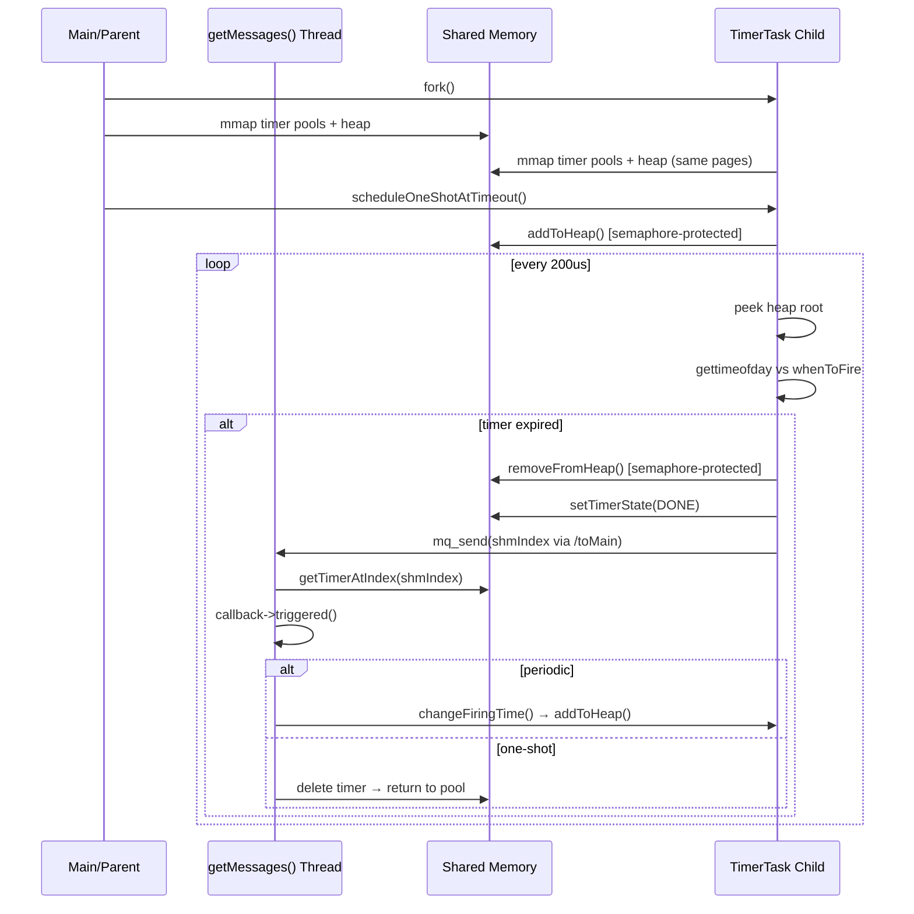
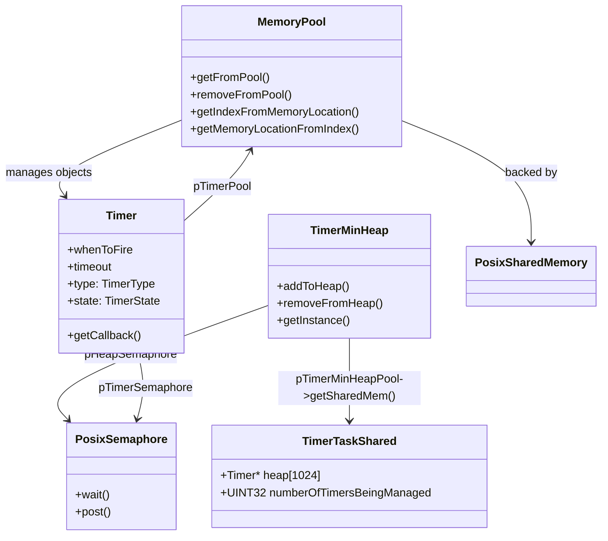
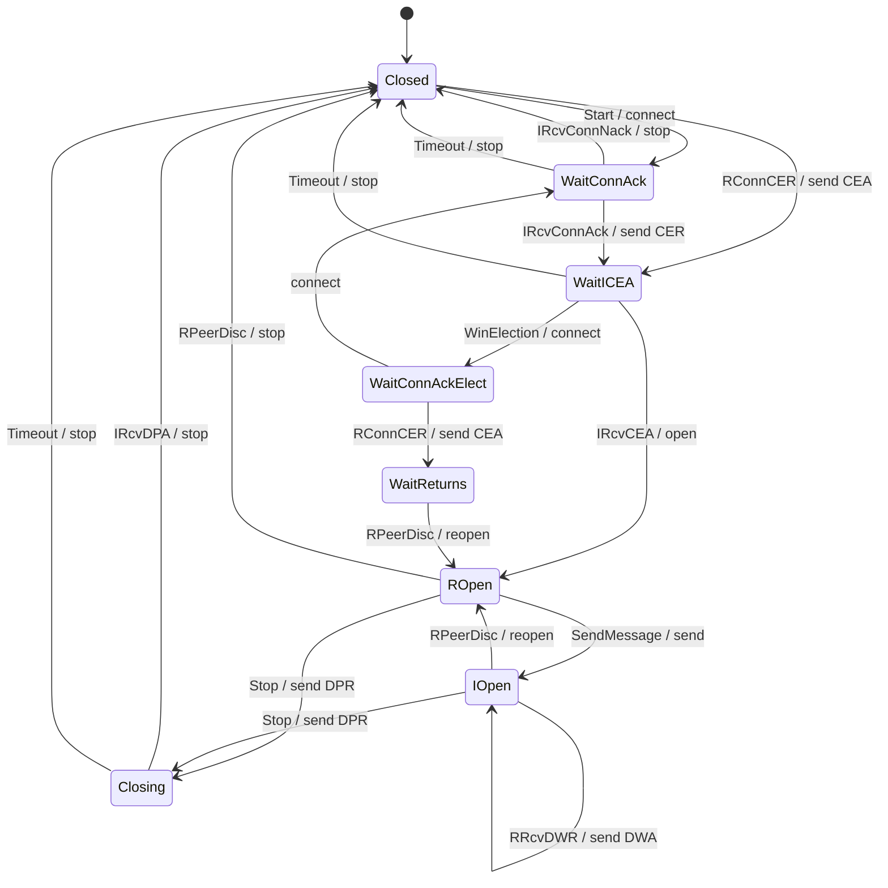

# Architecture: Timer Management in the Diameter Stack

## 1. What This Repo Does

This is a C++ implementation of the **Diameter protocol** (RFC 3588), the
AAA (Authentication, Authorization, Accounting) framework used primarily in
telecom and LTE/5G core networks (between PCRF, PCEF, OCS, etc.).

The codebase was written in **2012** for an embedded Linux telecom environment
where CPU, memory, and library availability were tightly constrained. The
architecture reflects those constraints — zero external dependencies beyond
POSIX, no standard library containers for shared data, no C++11 threading,
and no dynamic memory allocation from the heap for hot-path objects.

---

## 2. The Timer Management Problem

Diameter requires several protocol-level timers:

| Timer | Default | Purpose |
|-------|---------|---------|
| `Tc`  | 3 s     | Reconnection delay |
| `Tw`  | 30 s    | Watchdog (Device-Watchdog-Request interval) |
| `Tx`  | 30 s    | Request timeout (retransmission) |
| `Ty`  | 60 s    | Answer wait (proxy) |

In the **Diameter peer state machine**, timers trigger state transitions:

```
CLOSING ──(Rc timer)──► CLOSED
I_OPEN  ──(Tw timer)──► DWR sent ──(Rc timer)──► CLOSED
```

A production Diameter stack must juggle hundreds of concurrent timers: one
per peer for watchdog, one per pending transaction, reconnection backoff
timers, etc. Scanning a flat list of N timers every scheduler tick is O(N).
We need O(log N) insertion, deletion, and retrieval of the next-to-fire
timer.

---

## 3. The Min-Heap

### Data structure

```
                  ┌─────┐
                  │  3  │  <-- root = next timer to fire
                  └──┬──┘
                  ┌──┴──┐
               ┌──▼──┐ ┌▼───┐
               │  7  │ │ 5  │
               └──┬──┘ └──┬─┘
              ┌───┴┐   ┌──┴───┐
           ┌──▼─┐ ┌▼──┐ │ ... │
           │ 9  │ │12 │ └─────┘
           └────┘ └───┘
```

A **binary min-heap** stored in a contiguous array. Each node stores a
`Timer*`. The key is `whenToFire` (absolute time in milliseconds since
epoch). Property: every parent's firing time ≤ its children's firing times.

### Operations

All timer expiry goes through the root — the critical path is O(1) peek
plus O(log N) heapify:

| Operation | Complexity | Where |
|-----------|------------|-------|
| Peek at next timer | **O(1)** | `minheap[0]` |
| Remove root (expiry) | **O(log N)** | `removeFromIndex(0)` — swap with last, `downHeapify()` |
| Insert timer | **O(log N)** | `upHeapify()` — swim up |
| Cancel arbitrary timer | O(N) | `removeSpecificFromIndex()` — linear scan, then `downHeapify()` |

Cancellation (`removeSpecificFromIndex`) is the only O(N) path — it does a
pre-order scan of the array. This is acceptable for ≤1024 timers (the
hard-coded `MAX_NUMBER_OF_TIMERS`). A modern design would attach an index
handle to each `Timer` so cancellation becomes O(log N) or O(1).

### Implementation detail

```cpp
// TimerMinHeap.h — the heap is a shared-memory struct
struct TimerTaskShared {
  Timer* heap [MAX_NUMBER_OF_TIMERS];  // 1024 slots
  UINT32 numberOfTimersBeingManaged;
};
```

On x86_64 this is 8200 bytes (1024 × 8 + 4, padded). Both the parent and
child processes `mmap` this region at the same virtual address, so `Timer*`
pointers are valid in both address spaces.

---

## 3a. Timer Fire Lifecycle (Sequence Diagram)



## 3b. Shared Memory Object Relationships



## 3c. Diameter Peer State Machine



---

## 4. Why Shared Memory?

Timers fire in a **child process**, not in a thread. This was a deliberate
design choice for 2012:

### Thread vs process decision (2012)

```
                    Thread                         Process (fork)
Memory            Shared by default               Copied (COW) or explicit shm
Crash isolation   One thread brings down all      Child can crash independently
Synchronization   Mutexes, atomics                Semaphores, shared memory
Scheduling        Same address space              Context-switch overhead
Debugging         gdb with thread support         ptrace / core dumps per PID
```

The codebase chose **fork + shared memory** because:

1. **Fault isolation** — a buggy timer scheduler (infinite loop, segfault)
   kills only the child, not the main I/O loop or peer FSM.
2. **No threads in the compiler/libc** — some embedded toolchains in 2012
   had broken or incomplete pthreads.
3. **Determinism** — the timer child runs a tight `while(1)` + `usleep(200)`
   loop with no preemption from other threads in the same process.

### What is shared

```
┌─────────────────────────────────────────────┐
│                PROCESS A (parent)            │
│  ┌────────────────────────────────────────┐  │
│  │  TimerMinHeap (singleton per process)  │  │
│  │  points to ...                         │  │
│  └────────────┬───────────────────────────┘  │
│               │                               │
│         mmap(MAP_SHARED)                      │
│               │                               │
│         ┌─────▼──────────────────────┐        │
│         │ /dev/shm/timerMinheapPool  │        │  ← POSIX shared memory
│         │ ┌────┬────┬────┬────┬────┐ │        │
│         │ │ 0  │ 1  │ 2  │ 3  │ .. │ │        │  (same virtual addr
│         │ └────┴────┴────┴────┴────┘ │        │   in both processes)
│         └─────────────────────────────┘        │
│               │                                │
├───────────────┼────────────────────────────────┤
│ PROCESS B (child - TimerTask)                  │
│  ┌────────────▼───────────────────────────┐    │
│  │  TimerMinHeap (different instance,     │    │
│  │   same shared memory)                  │    │
│  └─────────────────────────────────────────┘   │
└─────────────────────────────────────────────────┘
```

Additionally, `Timer` objects are allocated from a `MemoryPool` backed by
`/dev/shm/timerObjectPool`. The pool's free list is also in shared memory,
so both processes can allocate and free objects from the same pool.

### Modern alternatives (2026)

| Aspect | 2012 approach | Modern alternative |
|--------|---------------|-------------------|
| Timer scheduling | Forked child + min-heap | `timerfd_create()` + `epoll` (Linux-native, no busy-loop) |
| Shared data | POSIX shm with raw pointers | `boost::interprocess` or `shm_mmap` with offset-based handles |
| Synchronization | Named POSIX semaphores | `std::atomic`, `futex`, or `std::mutex` with `pthread_mutexattr_setpshared` |
| Process model | `fork()` | Thread pool + `std::thread`, or `io_uring` for single-thread async |
| Timer data structure | Binary min-heap, O(N) delete | `std::priority_queue` + index map, or timer wheel (O(1) per tick) |

Specifically:

- **`timerfd_create()`** (Linux 2.6.25+) gives a file descriptor that
  becomes readable when a timer expires, trivially integrable with `epoll`.
  No child process needed, no shared memory, no semaphores.
- **Timer wheels** (Hashed/Timing Wheel, used by Linux kernel, Netty, Kafka)
  offer O(1) insert/cancel per tick at the cost of granularity. For a stack
  managing 10–100 timers a binary heap is fine; at 10k+ timers a wheel wins.
- **`io_uring`** (Linux 5.1+) can submit timer requests directly to the
  kernel, avoiding any userspace timer management entirely.

---

## 5. The Message Queue

### Flow

```
                  Timer fires
                       │
        ┌──────────────▼──────────────┐
        │  TimerTask::run() (child)   │
        │                              │
        │  1. Remove timer from heap   │
        │  2. Set state = DONE         │
        │  3. Create PosixMessageQueue │
        │     Object (shmIndex +       │
        │     TaskID)                  │
        │  4. mq_send (/toMain)        │
        └──────────────┬───────────────┘
                       │ POSIX message queue
        ┌──────────────▼───────────────┐
        │  getMessages() thread        │
        │  (parent process)            │
        │                              │
        │  1. mq_receive (/toMain)     │
        │  2. Deserialize              │
        │  3. ONE_SHOT: call callback, │
        │     delete timer              │
        │  4. PERIODIC: changeFiring-  │
        │     Time (re-add to heap)    │
        └──────────────────────────────┘
```

### Why a message queue instead of a direct call

Since the timer fires in the **child process**, it cannot directly invoke
the callback (the callback is code in the parent's address space). Instead:

1. The child sends a **message** containing the shared-memory index of the
   fired timer via the POSIX message queue `/toMain`.
2. The parent's `getMessages` thread (started with `pthread_create`) blocks
   on `mq_receive`.
3. On receipt, it looks up the `Timer*` from the shared-memory pool by
   index, and executes the callback.
4. For PERIODIC timers, it calls `changeFiringTime()` which re-inserts the
   timer into the shared heap (via the semaphore-protected `addToHeap`).

### Message format

```cpp
// PosixMessageQueueObject (serialized)
//  ┌────────────┬────────────┬──────────────┐
//  │  TaskID    │  padding   │  shmIndex     │
//  │  (8 bytes) │  (8 bytes) │  (8 bytes)    │
//  └────────────┴────────────┴──────────────┘
```

The `shmIndex` is the position of the `Timer` in the shared-memory pool.
Both processes can map this index to a pointer via
`MemoryPool::getMemoryLocationFromIndex()`.

### Modern alternatives

- **`eventfd()` + `epoll`**: Instead of a POSIX message queue (which
  requires `/dev/mqueue` mount, has kernel-configurable size limits, and
  limited message size), modern Linux uses `eventfd` for notification and
  shared memory for payload. The child writes the timer index to shared
  memory and does a single `write()` on the eventfd to wake the epoll loop.
- **`io_uring`**: The timer expiry and notification can be a single I/O
  uring submission, removing the need for any secondary notification channel.
- **In-process (thread-based)**: If timers ran in a thread instead of a
  child process, the callback would execute directly — no IPC needed.
  `std::this_thread::sleep_until` on a dedicated thread with a heap replaces
  the entire fork+shm+mq machinery.

---

## 6. Why This Still Matters

Despite being a 2012 codebase, the architecture demonstrates:

1. **Cross-process timer management** — how to safely coordinate time
   between two processes using POSIX primitives, valuable on systems where
   threads are not available or not desirable.

2. **Shared-memory pool allocation** — avoiding heap fragmentation in a
   long-running telecom process by pre-allocating fixed-size objects from
   a pool.

3. **Race-conscious design** — the "stale data reset" bug (where the child
   would clear timers the parent had just added) and its fix illustrate the
   subtleties of `fork()` + shared memory initialization ordering.

4. **Minimal dependencies** — the entire stack uses only POSIX APIs and
   libuuid. No Boost, no libevent, no C++ standard library threading.
   This makes it portable to any POSIX environment, including embedded
   Linux, QNX, or VxWorks.

---

## 7. Migrating to Modern C++ (sketch)

If you were to rewrite this today, a minimal thread-based timer would look
like:

```cpp
#include <thread>
#include <queue>
#include <mutex>
#include <condition_variable>
#include <chrono>
#include <functional>
#include <vector>

class TimerWheel {
  std::priority_queue</* expiry, callback */> heap_;
  std::mutex mtx_;
  std::condition_variable cv_;
  bool done_ = false;

  void run() {
    std::unique_lock lock(mtx_);
    while (!done_) {
      if (heap_.empty()) {
        cv_.wait(lock);
      } else {
        auto next = heap_.top().expiry;
        if (cv_.wait_until(lock, next) == std::cv_status::timeout) {
          auto cb = std::move(heap_.top().callback);
          heap_.pop();
          lock.unlock();
          cb();   // execute outside mutex
          lock.lock();
        }
      }
    }
  }
};
```

No fork, no shared memory, no message queue, no semaphores — just the
standard library.

---

## References

- RFC 3588 — Diameter Base Protocol
- RFC 4006 — Diameter Credit-Control Application
- Linux `timerfd_create(2)`, `eventfd(2)`, `io_uring(7)`
- "Hashed and Hierarchical Timing Wheels" — George Varghese, 1997
